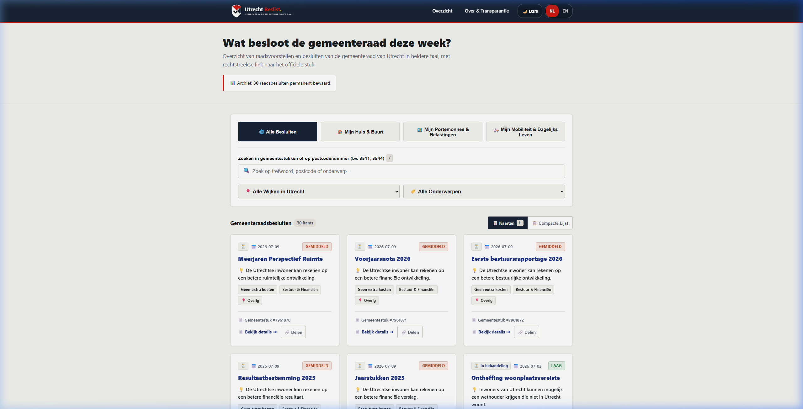

<p align="center">
  <picture>
    <source media="(prefers-color-scheme: dark)" srcset="static/img/logo-dark-mode.svg">
    
  </picture>
</p>

> Plain-language summaries (B1 Dutch + English) of official **Gemeente Utrecht** city council documents and decisions.
> Open source, 0 €/month, 100% static, privacy-first & automated.



---

## 🇳🇱 Nederlands

**Utrecht Beslist** is een open-source platform dat raadsvoorstellen, besluiten en documenten van de Utrechtse gemeenteraad automatisch verzamelt en samenvat in begrijpelijke B1-taal (Nederlands en Engels).

- **Databron:** [Open Raadsinformatie API](https://openraadsinformatie.nl/) (ElasticSearch endpoint `ori_utrecht*`)
- **AI-keten:** Groq (`llama-3.3-70b-versatile`) ➔ Google Gemini 1.5 Flash ➔ Degradatiemodus (fallback)
- **Directe transparantie:** Elk artikel linkt naar de ORI-registratie, het Utrechtse Raadsportaal en Woo-rechten (Wet open overheid). Publiceert Open Raadsinformatie PDF-bijlagen bij het stuk, dan staan die er allemaal bij; zo niet, dan zegt de pagina dat met zoveel woorden.
- **Permanente Archivering:** In overeenstemming met de *Archiefwet 1995* worden raadsbesluiten permanent bewaard.
- **UI-UX Pro Max:** Donkere modus (`☀️/🌙`), Atataflexie snelkoppelingen (`Ctrl+K`, `L`, `Esc`), Voorlezen in voz alta (TTS Audio) en Afdrukken naar PDF.
- **Privacy & Kosten:** 0 €/maand, 0 cookies, 100% statisch via GitHub Pages (`docs/`).

## 🇬🇧 English

**Utrecht Beslist** is an open-source platform providing plain-language summaries (B1 Dutch & English) of Utrecht city council decisions and official proposals.

- **Data Source:** Open Raadsinformatie ElasticSearch API (`ori_utrecht*`), including the MediaObject attachments that hold the actual document text and PDFs
- **AI Resiliency:** Multi-provider fallback chain (Groq ➔ Gemini ➔ Degraded Mode)
- **Facts come from the register, not the model:** decision state, dates, source links and attachments are read from ORI and overwrite whatever the summarizer returned
- **UI-UX Pro Max:** Dark mode toggle, keyboard navigation shortcuts, TTS read-aloud audio narration, and printable A4 PDF dossier reports.
- **100% Open Data & Woo Rights:** Sourced from official municipal registers under the Dutch Open Government Act (Woo).

---

## 🎨 Identity & Vector Logo Suite

Utrecht Beslist features a dedicated custom geometric shield logo inspired by the red/white diagonal mantle of Sint Maarten (the patron saint of Utrecht):

- `static/img/logo.svg`: Main horizontal SVG logo (English subtitle)
- `static/img/logo-nl.svg`: Main horizontal SVG logo (Dutch subtitle)
- `static/img/logo-dark-mode.svg`: High-contrast variant for dark backgrounds & GitHub Dark Mode
- `static/img/favicon.svg` & `icon.svg`: 1:1 Icon-only SVG variant
- `static/img/logo-monochrome.svg`: Single-color printable & footer variant

---

## 🛠️ Repository Structure

```
utrecht-beslist/
├── .github/workflows/
│   └── daily.yml          # GitHub Actions cronrunner (07:47 Amsterdam time)
├── scripts/
│   ├── pipeline.py        # Master pipeline orchestrator
│   ├── source_ori.py      # Open Raadsinformatie ElasticSearch client
│   ├── ai_chain.py        # Groq -> Gemini -> OpenRouter -> Degraded AI chain
│   ├── build_site.py      # Jinja2 static HTML renderer & detail page generator
│   ├── schemas.py         # Pydantic summary item schema
│   ├── themes.py          # Themes & Utrecht neighborhood taxonomy
│   ├── i18n.py            # UI strings, date formats & canonical status labels
│   ├── translate_missing.py  # Fills language variants the summarizer skipped
│   ├── backfill_sources.py   # Re-reads ORI facts onto existing entries
│   └── purge_placeholders.py # Strips values copied out of the prompt
├── templates/
│   ├── base.html          # Shell layout with SVG logo, Dark Mode & language switch
│   ├── index.html         # Option A UX control panel & card grid overview
│   ├── detail.html        # 4-section decision detail page template
│   └── over.html          # Transparency, methodology & Woo rights page
├── static/
│   ├── css/styles.css     # Utrecht visual identity tokens & print stylesheet
│   ├── js/app.js          # Filtering, shortcuts, Dark Mode, TTS & search engine
│   └── img/               # Vector SVG logo suite & preview screenshot
├── state/
│   └── processed.json     # Permanent document database record
├── docs/                  # Generated GitHub Pages production site
├── tests/                 # Pytest test suite (100% passing)
├── IMPECCABLE_AUDIT.md    # 360° Impeccable Audit Report (Grade: 98/100)
├── requirements.txt
├── LICENSE                # EUPL-1.2
└── README.md
```

---

## 🚀 Running Locally

1. **Clone & Install Dependencies:**
   ```bash
   cd utrecht-beslist
   pip install -r requirements.txt
   ```

2. **Execute Pipeline:**
   ```bash
   # Run pipeline with AI summarization keys enabled:
   python -m scripts.pipeline

   # Run automated test suite:
   PYTHONPATH=. pytest tests/
   ```

3. **Preview Generated Site:**
   ```bash
   python -m http.server 8080 --directory docs
   # Open http://localhost:8080/nl/index.html in your browser
   ```

### Translations

The site publishes eight languages, but the summarization step only reliably
returns Dutch and English. When a language is missing,
`get_item_lang_field()` falls back to English, so the page renders in English
without any error — which is how ES, TR, PT-BR, PT-PT, FR and DE shipped
English decision text for every entry.

`python -m scripts.pipeline` now logs a warning listing how many entries fall
back per language. To fill the gaps:

```bash
python -m scripts.translate_missing              # only what is missing
python -m scripts.translate_missing --dry-run    # just report the gaps
python -m scripts.translate_missing --force      # redo every language
```

It translates one language at a time and refuses a partial answer, retrying
before it gives up, because accepting a short response silently is what caused
the problem in the first place. `--recheck` additionally redoes any field the
model handed back in English or Dutch unchanged, which is how four entries once
shipped English prose under a Spanish, Turkish, French and German heading.

`.github/workflows/daily.yml` runs this after every pipeline run and rebuilds
the site afterwards, so the gaps no longer depend on someone remembering.

### Facts that do not come from the model

Decision state, publication date, source links and attachments are read from
Open Raadsinformatie and written over whatever the summarizer produced, because
the model was getting them wrong: six documents ORI records as passed were
displayed as still under review, and twenty carried a status of nothing but an
hourglass. `python -m scripts.backfill_sources` applies this to entries that
predate the change; it is idempotent and `--dry-run` reports first.

Amounts are only ever shown when a document states them. The prompt used to
illustrate the key-figure field with `2,5M €`, and the model answered with the
example on two unrelated decisions; `python -m scripts.purge_placeholders`
cleared those, and the prompt no longer offers an amount to copy.

---

## 📜 License

Licensed under the **European Union Public Licence v1.2 (EUPL-1.2)**.
Full license text available in [LICENSE](LICENSE).
