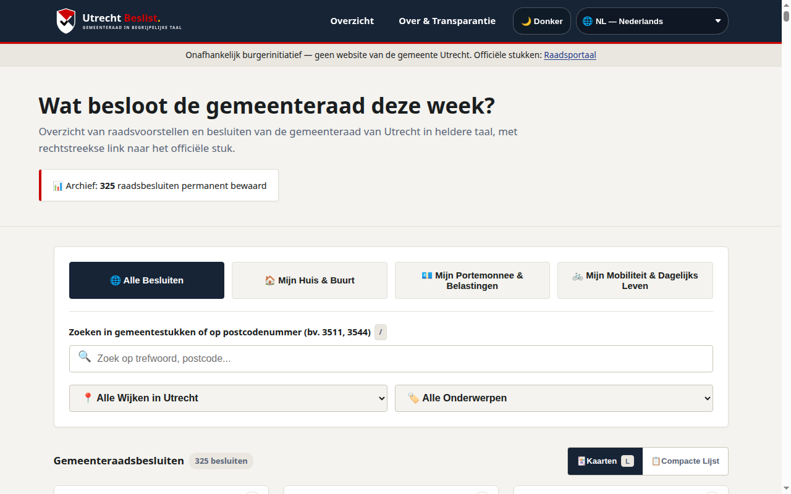
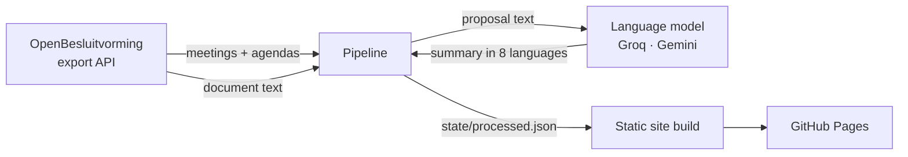

<p align="center">
  <picture>
    <source media="(prefers-color-scheme: dark)" srcset="static/img/logo-dark-mode.svg">
    
  </picture>
</p>

<p align="center">
  <strong>Utrecht city council decisions, explained in plain language — in eight languages.</strong>
</p>

<p align="center">
  <a href="https://utrecht-voor-iedereen.github.io/utrecht-beslist/">Website</a> ·
  <a href="https://utrecht-voor-iedereen.github.io/utrecht-beslist/en/over.html">How it works</a> ·
  <a href="https://github.com/utrecht-voor-iedereen/utrecht-beslist/issues/new/choose">Report an error</a>
</p>

<p align="center">
  <a href="https://github.com/utrecht-voor-iedereen/utrecht-beslist/actions/workflows/ci.yml"></a>
  <a href="https://github.com/utrecht-voor-iedereen/utrecht-beslist/actions/workflows/daily.yml"></a>
  <a href="LICENSE"></a>
</p>

> **Independent civic project.** Utrecht Beslist is not run by or affiliated with the Gemeente Utrecht. The official record is the [Raadsportaal](https://utrecht.bestuurlijkeinformatie.nl/).

**Nederlands —** Utrecht Beslist vat elke dag de raadsvoorstellen en raadsbesluiten van de Utrechtse gemeenteraad samen in begrijpelijke taal (B1), in acht talen. De status, datums en bronnen komen rechtstreeks uit het openbare register; alleen de uitleg wordt met AI geschreven. Gratis, zonder cookies of tracking, en open source.



## What it does

- Every morning (Monday to Saturday) it reads the new meetings of the Utrecht city council from [OpenBesluitvorming](https://openbesluitvorming.nl/), the public register of Dutch council information.
- For each council proposal (*raadsvoorstel*) and initiative proposal it writes a short summary at CEFR B1 level: what is decided, who it affects, what it costs and when it happens.
- Every summary is published in **Dutch, English, Spanish, Turkish, Brazilian and European Portuguese, French and German**.
- Readers can filter by district (*wijk*), topic or postcode, listen to a summary, print it, and follow the link to the official documents.

The site holds some 325 dossiers from January 2025 onwards. It is a static site on GitHub Pages: no server, no database, no cost.

## How it works


```mermaid
flowchart LR
    OBV[OpenBesluitvorming<br/>export API] -->|meetings + agendas| Pipeline
    OBV -->|document text| Pipeline
    Pipeline -->|proposal text| AI[Language model<br/>Groq · Gemini]
    AI -->|summary in 8 languages| Pipeline
    Pipeline -->|state/processed.json| Build[Static site build]
    Build --> Pages[GitHub Pages]
```

1. **Sync.** `scripts/source_obv.py` keeps a mirror of Utrecht's council meetings (`state/openbesluitvorming.json`) up to date through the export snapshot and changes feed.
2. **Select.** The pipeline takes every raadsvoorstel and initiatiefvoorstel on the agenda of a council meeting or the weekly proposals overview.
3. **Summarise.** The text of the proposal is sent to a language model, one document per request. The answer is validated against a fixed schema before it is kept.
4. **Publish.** `scripts/build_site.py` renders the pages in eight languages; `pages.yml` deploys them.

### What comes from the register, and what the AI writes

| Field | Source |
| --- | --- |
| Status (on the agenda, passed) | Register — *passed* once the signed raadsbesluit is published |
| Meeting date, official title, PDFs | Register |
| Summary, key points, key figure | Language model, from the text of the proposal |
| Translations | Language model |

The model is told to invent nothing, to quote amounts and dates only as the document states them, and to say nothing about the outcome of a vote. Themes and districts are kept to a closed list. A summary that fails validation is not published; the document waits for the next run.

## Status and limitations

- **AI can be wrong.** Every page links to the official document, and a summary is not legal advice.
- **The archive is being completed.** Entries from 2025 and early 2026 were imported with a provisional text; the daily run replaces them with real summaries, about fifteen dossiers a day.
- **Free tiers.** The site runs on the free tiers of Groq and Google Gemini. When one model is unavailable the next is tried; `ai-selftest.yml` checks every week that they still answer.
- **Accessibility.** Automated checks with axe (WCAG 2.1 AA) pass on the main pages; a screen-reader test is still to be done.

## Run it locally

Requires Python 3.12.

```bash
git clone https://github.com/utrecht-voor-iedereen/utrecht-beslist.git
cd utrecht-beslist
python -m venv .venv && source .venv/bin/activate
pip install -r requirements.txt
cp .env.example .env              # add at least GROQ_API_KEY

python -m scripts.build_site      # render the site from state/ into docs/
python -m http.server 8080 --directory docs
```

`python -m scripts.pipeline` runs a full update: it syncs from OpenBesluitvorming, summarises what is new and rebuilds the site. Without an API key it still runs, but new documents are left unpublished until a model is available.

### Configuration

| Variable | Purpose |
| --- | --- |
| `GROQ_API_KEY` | Primary provider ([Groq](https://console.groq.com/)) |
| `GEMINI_API_KEY` | Fallback provider ([Google AI Studio](https://aistudio.google.com/apikey)) |
| `GROQ_MODELS` | Groq models to try, in order (default `openai/gpt-oss-120b,openai/gpt-oss-20b`) |
| `GEMINI_MODELS` | Gemini models to try, in order (default `gemini-3.6-flash,gemini-3.5-flash,gemini-3.5-flash-lite`) |
| `MAX_NEW_PER_RUN` | New documents summarised per run (default `6`) |

### Checks

```bash
ruff check .
mypy scripts --explicit-package-bases --ignore-missing-imports
PYTHONPATH=. pytest tests/
python -m scripts.ai_selftest     # does every configured model still answer?
```

## Automation

| Workflow | When | What |
| --- | --- | --- |
| `daily.yml` | Mon–Sat 05:47 UTC | Sync, summarise new documents, fill translations, upgrade provisional entries, commit `state/` |
| `pages.yml` | On changes to `state/processed.json`, `scripts/`, `templates/` or `static/` | Build and deploy the site |
| `ci.yml` | Every push and pull request | Ruff, mypy, pytest |
| `ai-selftest.yml` | Weekly, on AI code changes, or by hand | One tiny request to every configured model |

## Repository layout

```
scripts/
  source_obv.py        OpenBesluitvorming client: meeting mirror, document text, import status
  pipeline.py          Daily run: select, summarise, apply register facts, save state
  ai_chain.py          Model chain (Groq → Gemini → hold back) and response validation
  build_site.py        Static site renderer
  translate_missing.py Fills languages the summariser left empty
  upgrade_backfilled.py Replaces provisional archive entries with real summaries
  i18n.py, over_content.py  Interface text and the "About" page, in eight languages
templates/             Jinja2 templates
static/                CSS, JavaScript, images
state/                 processed.json (all entries) and the OpenBesluitvorming mirror
tests/                 pytest suite
```

## Contributing

Found a wrong summary or a bug? [Open an issue](https://github.com/utrecht-voor-iedereen/utrecht-beslist/issues/new/choose) or use the *Report error* button on any page. Code contributions are welcome — see [CONTRIBUTING.md](CONTRIBUTING.md).

## License and credits

Code licensed under the [European Union Public Licence 1.2](LICENSE).

Council data from [OpenBesluitvorming](https://openbesluitvorming.nl/) (VNG), and until July 2026 from Open Raadsinformatie ([Open State Foundation](https://openstate.eu/)). Documents are published by the Gemeente Utrecht through iBabs. Summaries are generated with models served by [Groq](https://groq.com/) and [Google Gemini](https://ai.google.dev/).
